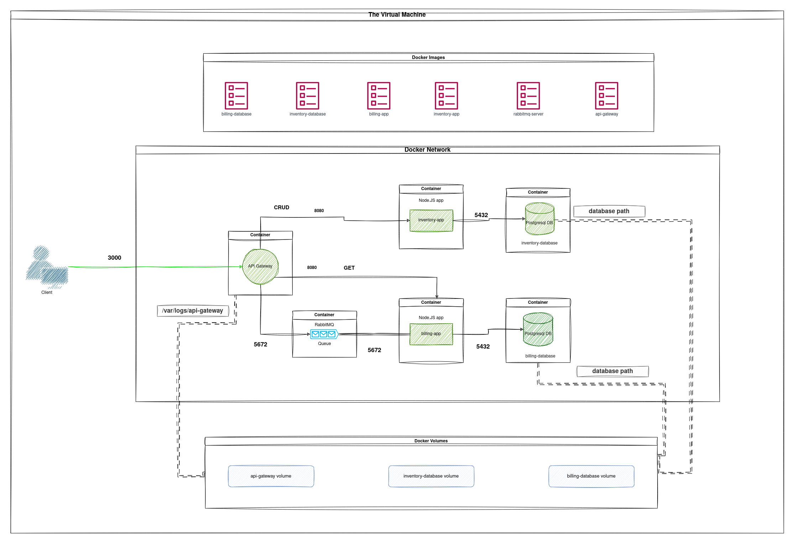

<!-- ctrl + shift + v to preview -->
# docker-microservice-architecture

## Table of Contents
- [docker-microservice-architecture](#docker-microservice-architecture)
  - [Table of Contents](#table-of-contents)
  - [General Information](#general-information)
  - [Features](#features)
  - [Technologies Used](#technologies-used)
  - [Team \& My Work](#team--my-work)
  - [Main Learnings](#main-learnings)
  - [Setup](#setup)

## General Information
This project was made as a school project in [kood/Jõhvi](https://kood.tech/) (20.7.2023)

The project required me to deploy a [previously](https://github.com/JesusKris/vagrant-microservice-architecture) created microservice architecture which included a gateway, a message queue system RabbitMQ & 2 other services with their own PostgreSQL instances, using docker compose. The infrastructure is provisioned using Vagrant and VirtualBox.



  **NB! Different source control platform was used hence no commit history.**

## Features
- Microservice architecture
- Automatic infrastrcture provisioning using Vagrant
- Message queue system

## Technologies Used

[Docker](https://www.docker.com/)

[Docker Compose](https://docs.docker.com/compose/)

[Vagrant](https://www.vagrantup.com/)

[Node.js](https://nodejs.org/en)

[PostgreSQL](https://www.postgresql.org/)

[RabbitMQ](https://www.rabbitmq.com/)


## Team & My Work
This was a solo project.

I did everything myself.

## Main Learnings
- Docker images, containers, networks
- Infrastrcture provisioning using Docker compose

## Setup
Clone the repository
```
git clone https://github.com/JesusKris/docker-microservice-architecture.git
```
Install VirtualBox
```
sudo apt install virtualbox
```

Install vagrant
```
sudo apt install vagrant
```

Rename .env-example to .env

Deploy the microservices
```
vagrant up --provider virtualbox
```